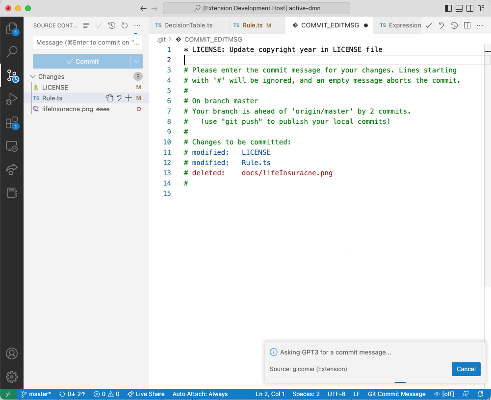

# gicomai README

gicomai is a (not very creative) acronym for **gi**t **co**mmit **m**essages from **AI**

## Features

gicomai takes the `diff` from the current repository and asks https://beta.openai.com to generate a commit message. The AI is usually quite impressive with this task.

If you have changes in your repository, that you want to commit, e.g.

 You can trigger the creation of the messages by pressing `Command-Enter` in the **empty** commit input (or selecting) `Commit-Commit` from the git menu. This opens the git commit message text editor. 
 
A commit message for every changed file will be generated and placed on top.

You can edit this as you like. 

The rest is default behavior. So when closing the editor, you will asked if you want to make the commit. 

Note: when you enter your own commit message into the commit input, the generation will not be triggered.

## Requirements

You need an OpenAI account and create your own **api-key** at https://beta.openai.com/account/api-keys

## Extension Settings

Please provide your _api-key_ in the settings:

* `gicomai.openai_apikey`: _your api-key_

## Known Issues

There is a limit of 4.000 tokens the API can handle. This translates roughly to 1.000 characters. Therefore only the 1st 1.000 characters of a file diff will be submittedt to the OpenAI API. There is also a limit of 20 calls per minute for the free plan. 

## Release Notes

### 0.0.4

- better error messages
- added known issues to the Readme

### 0.0.3

- added icon

### 0.0.2

 - a bit more info in the README
 - add the file a message belongs to
 - no empty lines between messages
 - add message if rate limit is reached

### 0.0.1

Initial release of gicomai

**Enjoy!**
